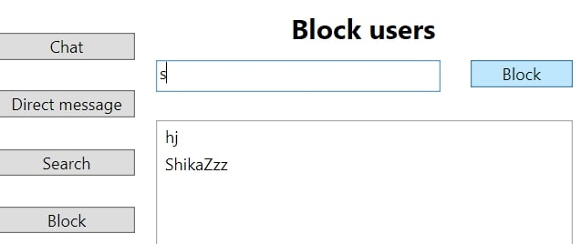

# UCLA-Chat-App

A chat app on which everyone connecting to the server could chat

---

UCLA Chat App is a WPF based application built on C#. In this chat app, a user can 
- sign in with a customized username
- chat with everyone on the server
- chat with a specific user
- search chat history
- control their own block list

The info of different users on the same device are saved locally and assoicated with their username. 

---
some screenshots of different functions

__sign in page__

__chat room__

__chat room with blocked users__

__direct chat__

__search history__

__search history with blocked users__

__block list__

